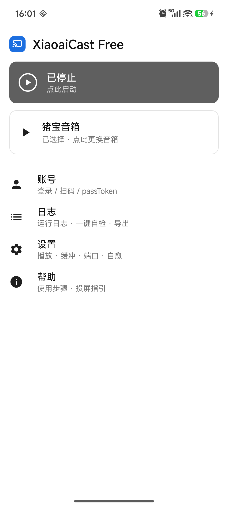
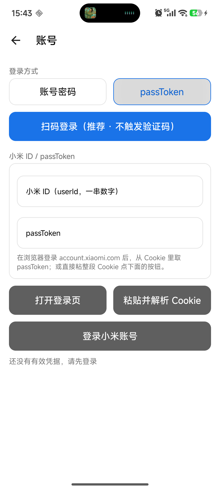
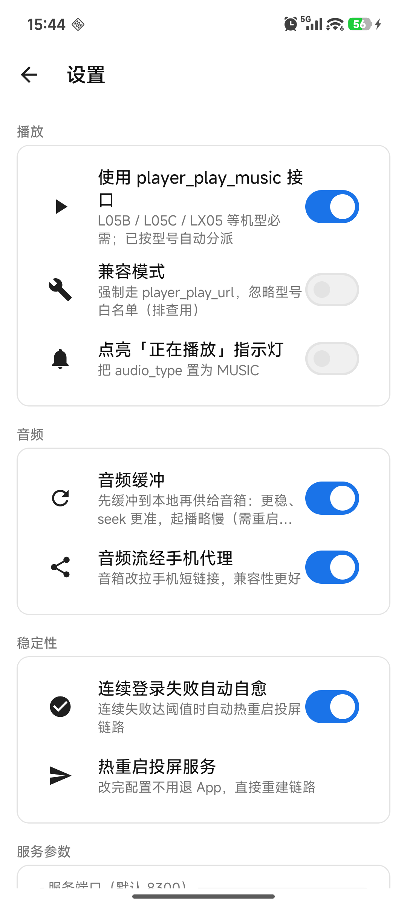
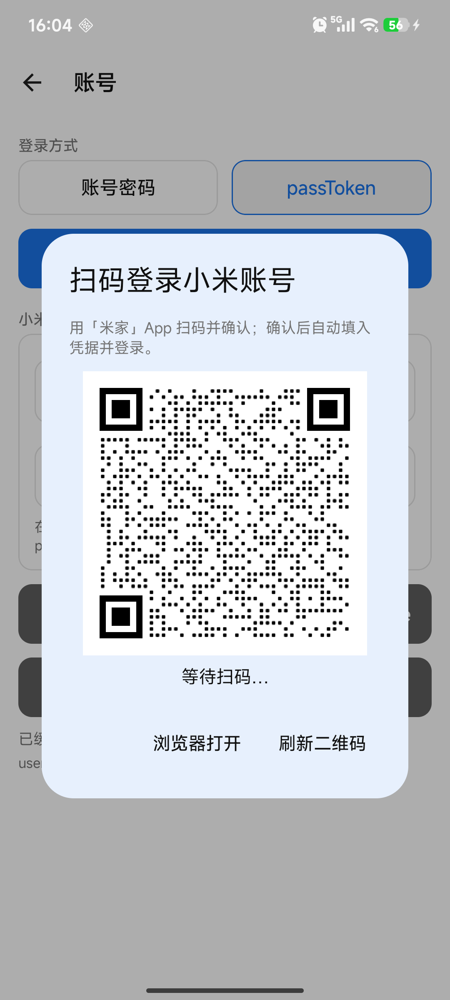

# 小爱DLNA · XiaoaiCast Pro

> 把手机音乐 App 的投屏指令，翻译成小爱音箱听得懂的话。
> **不需要 NAS、不需要服务器、不需要 root —— 中转层直接跑在手机里。**


| | |
|---|---|
| 应用名 | **小爱DLNA**（桌面 / 通知栏 / 系统设置里显示的名字） |
| 包名 | `com.tangren.xiaoairc`（升级覆盖的唯一依据，从未改动） |
| 平台 | Android 8.0+（API 26）/ targetSdk 34 |
| 语言 / 构建 | Kotlin 2.2.0 · AGP 8.9.0 · Gradle 8.11.1 · JDK 17 |
| UI | Jetpack Compose + Material 3 |
| 许可 | **MIT** |

> 📄 **想了解"为什么做、怎么做的"**：背景、决策记录、架构与踩坑清单见 [`docs/DEVELOPMENT.md`](docs/DEVELOPMENT.md)；
> UI 设计稿见 [`docs/UI设计稿.md`](docs/UI设计稿.md)。

---

## 一、开发背景

### 起因

手上有一台**小爱音箱 Play（L05B / L05C）**，它：

- ❌ 不支持**小米妙播**（妙播是较新机型才有的能力）
- ❌ 不支持 **DLNA / AirPlay**（协议栈根本没做）
- ✅ 只认小米自己的私有协议——只能由米家 App 或兼容小米协议的第三方应用控制

于是问题来了：**手机网易云音乐里正在放的那首歌，怎么让它从音箱里出来？**

官方路径全断了：妙播没有、DLNA 没有、蓝牙虽然能用但要手动切模式、占掉语音唤醒、音质只有 SBC。

### 已经有的开源方案，以及它们的共同门槛

社区里早有成熟方案，原理都一样——**在中间套一层代理**：

> 对外呈现成一个标准 DLNA 设备，对内把收到的 DLNA 指令翻译成小米云 API 调用。
> 音乐 App 以为自己投屏到了一台 DLNA 音箱；音箱只知道自己收到了一条播放指令。
> 双方都不需要知道对方存在。

| 项目 | 做了什么 | 门槛 |
|---|---|---|
| **MiAir** | 给小爱音箱补上 DLNA 渲染器 + AirPlay 接收器 | 需要一台常开的 Linux 设备（NAS / 软路由 / 树莓派），且必须是 host 网络 |
| **XiaoMusic** | 让小爱音箱播放本地/网络音乐库，支持语音口令 | 同上，还要挂音乐目录 |
| **本项目** | 把那一层代理**直接搬进手机 App** | **只要一部安卓手机**，不占额外设备 |

**关键洞察**：DLNA 投屏只传「音频地址」，不传音频本身。
所以中间层**不需要解码、不需要转码**——接住那个 URL、再通过小米云 API 让音箱去播就行。
这点计算量，手机完全可以扛。

### 所以这个项目要解决的就是

> 没有 NAS、没有软路由、没有树莓派，只有一台手机和一台小爱音箱的人，
> 也能获得"手机上一点投屏，声音从音箱出来"的体验。

---

## 二、这个项目做了什么

小爱DLNA 由早期的 XiaoAiCast（v0.1.1，纯 XML 引导式 UI）演进而来：**保持"纯手机端、零额外硬件"的定位不变**，
把与手机端形态相容的能力补齐，UI 层整体重写为 Jetpack Compose。

### 相对 v0.1.1 的新增能力

| 新增能力 | 说明 | 落地文件 |
|---|---|---|
| **音频缓冲模式** | 先把音频拉到本地文件再供给音箱：CDN 断流/重定向更抗造；源站不支持 Range 时也能 seek；总长度确切，进度条与 seek 更准。**落地文件而非内存**，大文件不 OOM。**默认关闭**（直连起播最快），开启后为边下边播、不再等整条 | `dlna/MediaBuffer.kt`、`dlna/MediaProxy.kt` |
| **设备型号自动分派** | 内置 22 款机型白名单，按 `hardware` 自动决定走 `player_play_music` 还是 `player_play_url`，减少"投上去没反应" | `xiaomi/DeviceCatalog.kt`、`SpeakerClient.kt` |
| **登录失败限速** | 窗口内失败过多先拒绝登录，避免反复触发小米风控；计数持久化，重启 App 不清零 | `xiaomi/LoginGuard.kt`、`xiaomi/MiAccount.kt` |
| **连续失败自愈** | 连续登录失败到阈值时自动热重启投屏链路（可关，两次间隔至少 10 分钟） | `CastService.kt`（看门狗） |
| **扫码登录** | 手机端直接出二维码，米家 App 扫一扫即得凭据，不触发验证码、不用翻 Cookie | `xiaomi/QRLogin.kt`、`ui/screens/Account.kt` |
| **子服务热重启** | 改端口/配置后不退出 App，一键重建 DLNA 链路；通知栏也可重启 | `CastService.kt`（`ACTION_RESTART`） |
| **日志脱敏** | 导出/复制日志前抹掉 passToken / serviceToken / ssecurity / password，避免求助时泄露凭据 | `util/Masking.kt`、`ui/ExportLog.kt` |
| **Compose UI** | 三屏骨架落地为 6 个页面，单 Activity + 轻量返回栈；设计 tokens 集中在 `ui/theme/Theme.kt` | `ui/`、`ui/screens/` |

原有能力（SSDP 应答器、UPnP HTTP 服务、DLNA 渲染器状态机、GENA 事件订阅、小米云控制、前台服务保活、一键自检）原样保留。

### v0.2.3 变更（应用更名与版本号收口）

| 变更 | 说明 |
|---|---|
| 应用显示名改为「小爱DLNA」 | 桌面图标、最近任务、通知栏、系统设置里的应用名、测试链路时音箱念的话、导出日志的表头与文件名，全部统一 |
| 协议层标识改为 `XiaoaiDLNA` | HTTP 头（`USER-AGENT`、SSDP `SERVER`）与 UPnP 设备描述里的 manufacturer / modelName / modelDescription 一律用 ASCII 拼写。**中文不能出现在这些字段**：HTTP 头按字节直传，非 ASCII 会乱码甚至破坏协议 |
| `modelNumber` 不再写死 | 原来一直停在 `0.1.0` 没跟着发版走；现在改为读 `BuildConfig.VERSION_NAME`，SSDP `SERVER` 头同样取值，版本号只剩 `app/build.gradle.kts` 一个来源 |
| 「关于」页版本号动态读取 | 原为硬编码（曾停在 `0.2.0`）；改为从 PackageManager 取，发版后不会再忘记同步 |
| 主题名一并更名 | `Theme.XiaoAiCast` → `Theme.XiaoaiDLNA`、`XiaoAiCastTheme` → `XiaoaiDLNATheme` |
| 其余内部标识 | WakeLock / MulticastLock 标签、日志 TAG、导出文件名前缀同步更名 |

> 更名**不动** `applicationId`（`com.tangren.xiaoairc`）—— 那是覆盖安装的唯一依据，改了会变成两个 App。

### v0.2.2 修复要点（连接健壮性）

| 修复 | 说明 |
|---|---|
| 代理读写超时不再是无限 | 原 `readTimeout(0)/writeTimeout(0)` 会在上游 CDN 挂起时**永久占住请求线程**（NanoHTTPD 每请求一线程）并泄漏连接；现改为 30s 空闲上限。OkHttp 该超时是「两次读写之间的最大空闲」，不是整个请求的总时长，故对长流安全 |
| HEAD 真正回真实长度 | 原实现读的是 `body.contentLength()`，而 HEAD 响应没有响应体、该值恒为 0，导致长度上报为 0；现改读响应头 `Content-Length` |
| 探测与下载分级超时 | HEAD / 元数据探测走派生 client（共享连接池），读超时 10s：只等响应头，快速失败不占用线程 |
| HEAD 响应头不再重复 | 手动 `addHeader` 与 NanoHTTPD 的无条件输出会叠加出两条 `Content-Length`；改为让响应自身携带长度，只输出一条 |

### v0.2.1 修复要点（缓冲默认值与投流兼容性）

| 修复 | 说明 |
|---|---|
| 缓冲模式默认关闭 | 直连为默认路径，起播回到 1~2s 体感；缓冲仅作 CDN 不稳定时的兜底 |
| 缓冲改渐进式供给 | 开区间请求落盘 64KB 即开始回数据（原为等整条下完，音箱 10~15s 超时直接失败） |
| HEAD 真实探测 | 代理对 HEAD 回真实 Content-Length / Content-Range / 206，不再回空 200 |
| 上游拒绝自动重试 | 源站返回非 200/206 或 `text/html` 时，换浏览器 UA 重试一次 |
| Content-Range 合规 | 只在 206 响应附带，修掉 200 带 Content-Range 的 RFC 违规 |
| DLNA 标准头 | 补 `transferMode.dlna.org: Streaming` |
| 白名单不再覆盖用户开关 | 优先级：兼容模式 > 用户显式设置 > 型号白名单 > 全局开关 |
| 自愈退避 | 两次自愈热重启至少间隔 10 分钟；冷启动清零连续失败计数 |
| 缓冲开关即时生效 | 服务运行中拨动缓冲开关自动热重启，改完不用手动重启 |

---

## 三、复用项目（致谢）

鉴于其他前辈的研究与开发，以下内容**直接复用或逐行移植**了现有开源成果。
所有引用项目均为 MIT / BSD 许可，可自由使用与修改。如有侵权请联系删除。

### 3.1 MiAir —— 复用最多

- 仓库：https://github.com/KiriChen-Wind/MiAir
- 许可：**MIT**
- **它解决了什么**：首次把「小爱音箱」伪装成标准 DLNA 渲染器（MediaRenderer），并踩平了 UPnP/GENA 的所有细节。

| 复用了 | 具体内容 | 落在本项目的哪里 |
|---|---|---|
| UPnP 服务描述文件（SCPD） | `AVTransport.xml` / `RenderingControl.xml` / `ConnectionManager.xml` 三个 XML **原样抽取** | `app/src/main/res/raw/*.xml` |
| 设备描述 XML 结构 | `<dlna:X_DLNADOC>DMR-1.50`、`<dlna:X_DLNACAP>audio-only`，以及让 QQ 音乐认出来的 `<qq:X_QPlay_SoftwareCapability>QPlay:2` | `dlna/UpnpConst.kt` |
| SOAP 报文模板 | 响应与错误报文格式（含参数转义规则） | `dlna/UpnpConst.kt` |
| GENA 事件格式 | `LastChange` 事件体的转义写法 | `dlna/UpnpConst.kt` |
| SSDP 交互策略 | 需要通告的 ST/USN 组合、按 MX 随机延迟应答、30 秒 alive 心跳 | `dlna/SsdpResponder.kt` |
| 机型经验 | 必须走 `player_play_music` 的机型清单、`audio_id` 默认值 | `SpeakerClient.kt`、`xiaomi/DeviceCatalog.kt` |
| 状态机语义 | 视频链接要拒绝、暂停语义在部分机型上要落到 stop | `dlna/UpnpRenderer.kt`、`SpeakerClient.kt` |

### 3.2 miservice —— 小米云接口的权威实现

- 仓库：https://github.com/yihong0618/miservice
- 许可：**MIT**
- **它解决了什么**：把小米账号认证流程（passToken / 密码换 serviceToken）和 MiNA 私有接口的调用方式逆向清楚并开源。

| 复用了 | 具体内容 | 落在本项目的哪里 |
|---|---|---|
| 认证流程 | `serviceLogin` → `serviceLoginAuth2` → `securityTokenService`（`clientSign = base64(sha1("nonce=…&ssecurity"))`） | `xiaomi/MiAccount.kt` |
| passToken 换取长期凭据 | Cookie 组合（`sdkVersion` / `deviceId` / `userId` / `passToken`）+ 米家 App UA | `xiaomi/MiAccount.kt` |
| MiNA 请求规范 | `https://api2.mina.mi.com`、`requestId` 生成规则、Cookie 用 `userId + serviceToken` | `xiaomi/MiAccount.kt` |
| ubus 调用约定 | `POST /remote/ubus`，form = `deviceId / message(json) / method / path` | `xiaomi/MiNaClient.kt` |
| 播放接口 | `player_play_url` / `player_play_music` / `player_play_operation` / `player_set_volume` / `player_get_play_status` 的参数与 JSON 结构 | `xiaomi/MiNaClient.kt` |
| 机型分派逻辑 | 哪些机型必须走 music 接口 | `xiaomi/DeviceCatalog.kt` |

### 3.3 XiaoMusic —— 最经得起折腾的那套

- 仓库：https://github.com/hanxi/xiaomusic
- 许可：**MIT**
- **它解决了什么**：长期维护、覆盖 20+ 机型的播放控制经验，以及大量固件怪癖的实测结论。

| 复用了 | 具体内容 | 落在本项目的哪里 |
|---|---|---|
| **暂停要发两条指令** | `force_stop_xiaoai` 的实现：先 `player_pause` **再** `player_stop`，单发任一条都可能不生效 | `SpeakerClient.kt` 的 `hardStop()` |
| 停止后回查状态 | `stop_if_xiaoai_is_playing` 的思路：发完指令要回查真实状态，不能假定成功 | `SpeakerClient.kt` |
| 机型支持清单 | 各型号硬件差异（哪些不支持 flac 等） | README / `DeviceCatalog.kt` |

### 3.4 NanoHTTPD —— 内嵌 HTTP 服务器（本项目给它打了补丁）

- 仓库：https://github.com/NanoHttpd/nanohttpd
- 许可：**BSD-3-Clause**
- 用法：**没有走 Maven 依赖**，而是把 2.3.1 的单文件源码 vendor 进仓库（`app/src/main/java/fi/iki/elonen/NanoHTTPD.java`），并**做了唯一一处修改**：给 `Method` 枚举补上 `SUBSCRIBE` / `UNSUBSCRIBE` / `NOTIFY`。

**为什么必须改**（已核对 2.3.1 源码）：

```java
this.method = Method.lookup(pre.get("method"));
if (this.method == null) {
    throw new ResponseException(Response.Status.BAD_REQUEST,
        "BAD REQUEST: Syntax error. HTTP verb " + pre.get("method") + " unhandled.");
}
// ... 之后才是 r = serve(this);
```

原版枚举只有 16 个 HTTP 动词，没有 GENA 需要的这三个。于是 `SUBSCRIBE` 会在**进入 `serve()` 之前**就被库直接 400 掉，
UPnP 的事件订阅能力等于不存在——网易云靠轮询还能凑合，**QQ 音乐 / QPlay 依赖事件订阅，会直接"设备无响应"**。

### 3.5 其余参考

- **机型白名单等事实性数据**（`DeviceCatalog`）整理自 [`miair-next`](https://github.com/deerwan/miair-next) 及其上游的实测结论。
  ⚠️ `miair-next` 为 **GPL-3.0**（其 FairPlay 组件为 GPL-2.0），为避免许可污染，本项目**仅参考其思路独立重写，未复制其源码**。
  **本仓库不包含任何 GPL 代码。**
- **本项目自己写的部分**：安卓前台服务与保活策略、音频流代理与缓冲（Range / seek / 渐进式供给 / 超时治理）、
  机型自动分派、登录限流与自愈、扫码登录、日志脱敏、这套 Compose UI，以及全部 Kotlin 代码。

---

## 四、它和现有方案的区别

| | MiAir | XiaoMusic | **小爱DLNA（本项目）** |
|---|---|---|---|
| 跑在哪 | Linux（NAS / 软路由） | Linux（NAS / Docker） | **安卓手机** |
| 要额外硬件 | 要 | 要 | **不要** |
| 投屏体验 | DLNA + AirPlay | 语音口令 + 本地库 | DLNA / QPlay |
| 面向场景 | 已有 NAS 的玩家 | 想"无限听歌" | **只想把手机上的歌甩到音箱** |
| 部署 | Docker，需 host 网络 | Docker + 挂音乐目录 | **装个 APK** |

---

## 五、它是怎么工作的

```
┌─────────────┐   DLNA/QPlay    ┌──────────────────┐   小米云 API   ┌────────────┐
│  音乐 App    │ ──────────────> │  小爱DLNA App    │ ────────────> │  小爱音箱   │
│ (网易云/QQ)  │  只发一个音频URL  │  伪装成 DLNA 设备  │  下发播放指令   │  L05B/L05C │
└─────────────┘                 └──────────────────┘               └────────────┘
                                         │                                ▲
                                         └── 本地 HTTP 音频代理 ────────────┘
                                             （直连，或先缓冲到本地文件再供给）
```

各模块职责：

| 模块 | 文件 | 干什么 |
|---|---|---|
| SSDP 应答器 | `dlna/SsdpResponder.kt` | 监听 `239.255.255.250:1900`，回复 M-SEARCH，让音乐 App 发现"设备" |
| UPnP HTTP 服务 | `dlna/UpnpHttpServer.kt` | 设备描述 / SOAP 控制 / GENA 事件订阅 / 音频流代理 |
| DLNA 渲染器 | `dlna/UpnpRenderer.kt` | 渲染器状态机，把指令翻译成小米云调用 |
| 音频代理 | `dlna/MediaProxy.kt` | 直接透传，或交给缓冲层；Range / seek 字节偏移 |
| 音频缓冲 | `dlna/MediaBuffer.kt` | 渐进式落盘到本地文件再供给音箱，抗 CDN 抖动 |
| 小米云 | `xiaomi/MiAccount.kt`、`xiaomi/MiNaClient.kt` | 登录（密码 / passToken / 扫码）与播放控制 |
| 登录保护 | `xiaomi/LoginGuard.kt` | 失败限速 + 连续失败自愈计数 |
| 型号分派 | `xiaomi/DeviceCatalog.kt` | 按机型决定 music / url 接口 |
| 前台服务 | `CastService.kt` | 编排链路 + WakeLock/MulticastLock 保活 + 热重启 + 自愈看门狗 |

---

## 六、技术栈

| | |
|---|---|
| 语言 | Kotlin 2.2.0 |
| 构建 | AGP 8.9.0 + Gradle 8.11.1 + JDK 17 |
| 最低版本 | Android 8.0（API 26）/ targetSdk 34 |
| 网络 | OkHttp 4.12.0 |
| 内嵌 HTTP 服务 | NanoHTTPD 2.3.1（vendored + 打补丁） |
| 并发 | Kotlin Coroutines（网络与 socket 全部跑在 IO 调度器） |
| UI | Jetpack Compose（BOM 2024.06.00 → Compose 1.6.8 / Material3 1.2.1） |

国内网络已在 `settings.gradle.kts` 配置阿里云镜像优先、官方源兜底。

---

## 七、目录结构

```
XiaoaiCast-Pro/
├── app/src/main/java/com/tangren/xiaoairc/
│   ├── MainActivity.kt              单 Activity 入口
│   ├── CastService.kt               前台服务：编排整条链路 + 保活 + 热重启 + 自愈看门狗
│   ├── SpeakerClient.kt             音箱控制（播放/暂停/音量，含 pause+stop 双发逻辑）
│   ├── Prefs.kt / LogBus.kt / NetUtil.kt
│   ├── dlna/
│   │   ├── SsdpResponder.kt         SSDP 组播应答（MulticastSocket）
│   │   ├── UpnpHttpServer.kt        设备描述 / SOAP / GENA / 流代理
│   │   ├── UpnpRenderer.kt          DLNA 渲染器状态机
│   │   ├── MediaProxy.kt            音频流代理（Range + seek + 分级超时）
│   │   ├── MediaBuffer.kt           缓冲层（渐进式落盘供给）
│   │   └── UpnpConst.kt             UPnP 常量与 XML 模板
│   ├── xiaomi/
│   │   ├── MiAccount.kt             认证 + micoapi 请求
│   │   ├── MiNaClient.kt            设备列表与播放控制指令
│   │   ├── DeviceCatalog.kt         机型能力目录（22 款白名单）
│   │   ├── LoginGuard.kt            登录失败限速
│   │   └── QRLogin.kt               扫码登录
│   ├── ui/
│   │   ├── AppState.kt              状态与动作集中处（等价 ViewModel）+ 轻量返回栈
│   │   ├── Components.kt            可复用组件（状态块 / 入口卡 / 列表行 / 开关行 …）
│   │   ├── SelfCheck.kt / GuideSteps.kt / ExportLog.kt
│   │   ├── screens/                 Home / Devices / Account / Settings / Log / Help
│   │   └── theme/Theme.kt           设计 tokens
│   └── util/Masking.kt              日志脱敏
├── app/src/main/res/raw/            三个 SCPD 服务描述（抽取自 MiAir）
├── docs/                            DEVELOPMENT.md、UI设计稿.md、真机截图
├── scripts/local-build.sh           隔离目录一键构建
└── .github/workflows/build.yml      推上去就能在云端出 APK
```

---

## 八、快速开始

### 直接安装 APK

到本仓库 **Releases** 页下载 `XiaoaiCast-Pro-vX.Y.Z-release.apk` 安装（需允许未知来源）。

> **小米 / HyperOS 用户注意**：部分机型直接 `adb install` 会被 `INSTALL_FAILED_USER_RESTRICTED` 挡住，
> 先把 APK 推到设备再走 `pm install` 即可：
>
> ```bash
> adb push XiaoaiCast-Pro-vX.Y.Z-release.apk /data/local/tmp/x.apk
> adb shell pm install -r /data/local/tmp/x.apk
> ```

### 从源码构建

```bash
bash scripts/local-build.sh          # debug
bash scripts/local-build.sh release  # release（无签名配置时跳过签名）
```

或用 Android Studio 直接打开工程（`local.properties` 指向本机 SDK，不入库）。

Release 签名口令从全局 `gradle.properties` 读取（`XIAOAIRC_STORE_FILE` 等），读不到则跳过签名。

CI：`.github/workflows/build.yml` 推上去即可在云端出 debug APK。

---

## 九、App 里怎么操作

打开首页就是「运行状态块 + 入口卡 + 入口列表」，左侧是六个页面：

1. **状态块**（灰／蓝两态）：点一下启动或停止投屏服务；运行时副文案显示 `http://ip:port`。
2. **入口卡**：显示当前选中的音箱与接口路径，点进去是**音箱列表**——每台一张复合卡片
   （单选圆点 + 状态 + 音量进度条），右上 `⋮` 可测试播报 / 停止播放 / 复制 deviceId；顶栏可刷新或手动添加。
3. **账号**：扫码登录（推荐，米家 App 扫一扫）｜账号密码｜passToken + 粘贴解析 Cookie。
4. **日志**：一键自检 + 实时日志 + 复制（自动脱敏）/ 导出分享 / 清空。
5. **设置**：播放接口与开关、音频缓冲与代理、自动自愈与热重启、端口/设备名/音量、重置 UDN、关于。
6. **帮助**：9 步使用步骤（实时标记完成）+ 投屏指引。

### 前置步骤（缺一不可）

| 步骤 | 做什么 |
|---|---|
| 1 | 允许通知权限（前台服务保活需要） |
| 2 | 加入电池优化白名单（否则锁屏后被系统杀掉） |
| 3 | 登录小米账号（扫码最快；也可账号密码 / passToken） |
| 4 | 刷新并选中你的小爱音箱（L05B / L05C 等） |
| 5 | 确认手机连的是 Wi-Fi（和音箱同一路由器） |
| 6 | 确认端口（默认 8300） |
| 7 | 启动投屏服务 |
| 8 | 去音乐 App 点投屏 |

### 三个救急功能

- **测试链路**：让音箱说一句话，2 秒判断"账号 + 设备 ID"这条链路是否正常，把故障一刀切开
- **一键自检**：9 项检查（权限 / Wi-Fi / 局域网 IP / 端口 / 账号 / 音箱在线 / SSDP），输出 ✅⚠️❌ 清单
- **导出分享日志**：日志写成文件直接发出去，且已自动脱敏

---

## 十、关键实现细节

### 10.1 音频流为什么要走手机代理

音箱直接拉音乐平台的 CDN 长链接经常失败（链接过长 / 需要特定 UA）。让音箱改拉手机上的短链接、
由手机去取真实数据再吐给音箱，成功率高很多，顺带把进度条拖动（seek）也支持了——
seek 的实现是按"播放位置 / 总时长"比例换算字节偏移，配合 Range 请求。MP3 解码器会在帧头重新同步，所以是近似定位。

代理侧对上游做了三件事：

1. **HEAD 真实探测**：把上游的 `Content-Length` / `Content-Range` / 状态码如实回给音箱，不糊弄。
2. **被拒自动重试**：源站返回非 200/206 或 `text/html`（风控页的典型长相）时，换浏览器 UA 再试一次。
3. **DLNA 头补全**：`transferMode.dlna.org: Streaming`、`Accept-Ranges: bytes`，Content-Range 只在 206 出现。

### 10.2 缓冲模式：渐进式供给，不是等整条

早期实现是"整条下完再给音箱"，结果音箱等 10~15 秒直接超时失败——**这是当初"体验不如初代版本"的主因**。现在的做法：

- 代理把上游数据写进本地临时文件，写入头推进到 **64KB** 就立刻开始向音箱回数据（`MediaBuffer.awaitStart`）
- 音箱读得快就等新数据（`FollowerInputStream` 在写入头追上来之前不退 EOF）
- 两条保险：15s 等不到首段就**回退直连**；下载停滞 30s 按 EOF 收尾

另外，**缓冲默认关闭**。正常 CDN 下行速度远超音频码率（128kbps 的 mp3 才 16KB/s），直连起播最快；
缓冲是给"CDN 不稳定"准备的兜底，服务运行中拨动开关会自动热重启生效。

### 10.3 超时与线程：为什么不能有无限超时

NanoHTTPD 的 `DefaultAsyncRunner` 是**每个请求开一个线程**。所以只要有一个请求永远不返回，那个线程就永远回不来。

早期代理给音频流配的是 `readTimeout(0) / writeTimeout(0)`（无限），一旦上游 CDN 接受连接后不吐数据，
请求线程会永久挂住、连接也不释放——**实测复现过：上游静默时请求无限挂起**。

现在改为：

| 场景 | 超时 | 理由 |
|---|---|---|
| 音频流代理 | **30s 空闲** | 该超时是「两次成功读写之间的最大空闲」，只要数据还在流动就不会打断；静默 30s 才判定连接已死 |
| HEAD / 元数据探测 | **10s**（派生 client，共享连接池） | 探测只等响应头、不搬数据，没必要跟流式下载共用 30s 容忍度 |

修复后实测：上游挂起时在 **30.02 秒**准时 `代理取流失败: timeout` 并释放线程。

### 10.4 密码登录失败长什么样

小米在密码校验不通过 / 触发风控时，`serviceLoginAuth2` **返回的不是 JSON，而是一整个登录页 HTML**
（`Content-Type: text/html`，body 是一堆空行 + `<!doctype html>`）。
这种失败方式极其隐蔽，解析报错会指向"JSON 格式异常"，让人以为是代码问题。
本项目会明确提示：*"返回的是登录页 HTML 而不是 JSON——账号密码没通过校验或被风控拦了，建议改用 passToken"*。

### 10.5 机型自动分派

部分机型直接 `player_play_url` 会返回错误码或不生效，必须走 `player_play_music`。
`DeviceCatalog` 内置了 22 款需要 music 接口的型号（含 L05B / L05C / LX05 / X08C …），按设备 `hardware` 自动分派。

优先级设计成**用户永远能盖过白名单**：

```
兼容模式（用户显式）＞ 用户改过的 music 开关 ＞ 型号白名单 ＞ 全局开关
```

白名单只在"用户从没动过这个开关"时代做决定，避免出现"我明明关了，它却自己开了"。

---

## 十一、真机实测记录

在 **小米 13（fuxi）/ Android 16 / HyperOS 3.0** + **小爱音箱 Play（L05B，走 music 接口）** 上完成装机联调：

| 项目 | 结果 |
|---|---|
| 安装与启动 | 安装成功（走 `pm install` 绕过 HyperOS 的 streamed install 限制），启动无崩溃 |
| 投送链路 | 完整跑通：代理解析出播放地址 → `player_play_music` 已下发 → **下发后 5ms 音箱就来取流** → 上游返回 `audio/mpeg` |
| 出声 | ✅ 正常出声 |
| QQ 音乐 | ✅ 可正常投放（QPlay 依赖 GENA 事件订阅，NanoHTTPD 的动词补丁是前提） |
| HEAD 探测 | `Content-Length: 103070`（真实长度），且只输出一条 |
| 超时治理 | 上游挂起场景实测 **30.02s** 准时失败并回收线程 |

> 长时稳定性（连续播放数小时的连接与内存表现）仍需持续观察。

---

## 十二、界面截图（真机实测）

| 主界面 | 音箱列表 |
|---|---|
|  |  |

| 账号 | 设置 |
|---|---|
|  |  |

| 扫码登录（二维码按屏幕宽度铺满，方便扫） |
|---|
|  |

---

## 十三、已知限制

| 限制 | 说明 |
|---|---|
| 只支持 DLNA / QPlay 投送 | iPhone 的 AirPlay 用不了——AirPlay 传的是 FairPlay 加密音频流，中间层必须实时解密 + 转码，手机端做这个不划算 |
| L05B / L05C 不支持 flac | 小爱音箱硬件限制，投送的源最好是 mp3 / aac |
| 进度条拖动是"近似"的 | 按比例换算字节偏移，可能有零点几秒偏差 |
| 本地文件投屏 | DLNA 的 `SetAVTransportURI` 传的是 URL，手机本地文件需要先起 HTTP 服务对外暴露，暂未实现 |
| 缓冲模式起播 | 已改渐进式供给（落盘 64KB 即开始回数据），但 CDN 极慢时首段等待会拉长 |
| 手机得活着 | 前台服务 + WakeLock + 电池白名单都做了，部分国产 ROM 仍可能杀后台，建议锁定后台任务 |
| 同一时间只服务一个投送端 | 换歌会复用同一条链路；多端同时投送的行为未做专门处理 |

---

## 十四、免责声明

- 本项目**仅供个人学习与自用**，不得用于任何商业用途。
- 控制音箱需要向小米云提交账号凭据（密码或 passToken）。**请勿使用绑定摄像头等敏感设备的账号**，
  也不要把服务端口暴露到公网。凭据仅保存在本机 SharedPreferences 中，不会上传到任何第三方。
- 使用本项目可能带来的任何后果（包括但不限于设备异常、账号风控）由使用者自行承担。

---

## License

本项目代码以 **MIT** 许可开源（见 `LICENSE`）。

其中 vendor 的 `NanoHTTPD.java` 遵循其原始 **BSD-3-Clause** 许可（文件头保留原始版权声明）；
UPnP 相关 XML 模板与协议经验来自 **MIT** 许可的 MiAir / miservice / XiaoMusic，均已在上文列明出处。
机型白名单等事实性数据整理自 miair-next（GPL-3.0），**仅参考思路独立重写，未复制其源码**。
